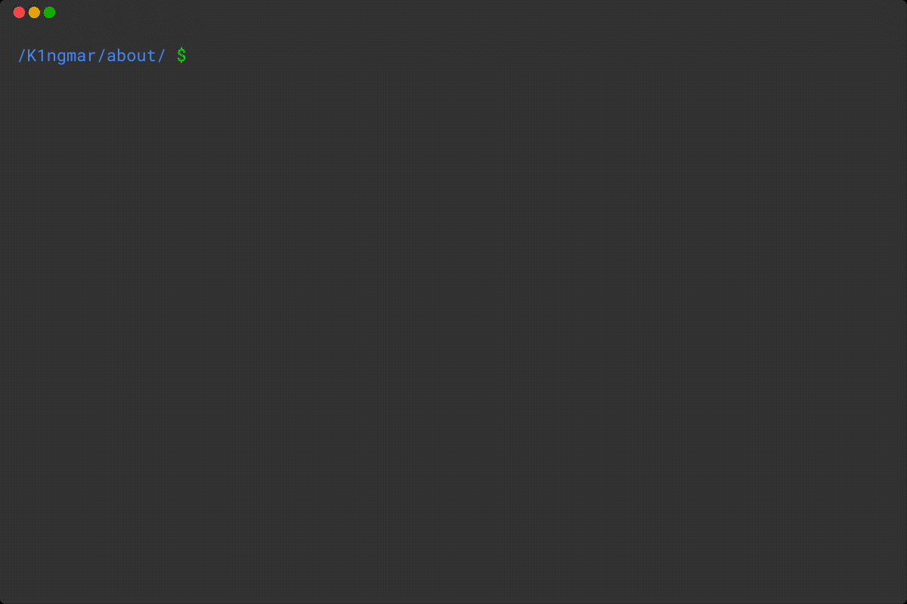

# 
 Hi there 👋 

---

## 
 🧑‍🎓 School projects 

  All my school projects can be found [here](https://github.com/42-Ikole) 👈🏻

## 
 ✔️ Languages and technologies 

  
  
  
  
  

## 
 🤙  You can reach me here 

  
  

---

## 
 📈 github Stats

  
  

 

